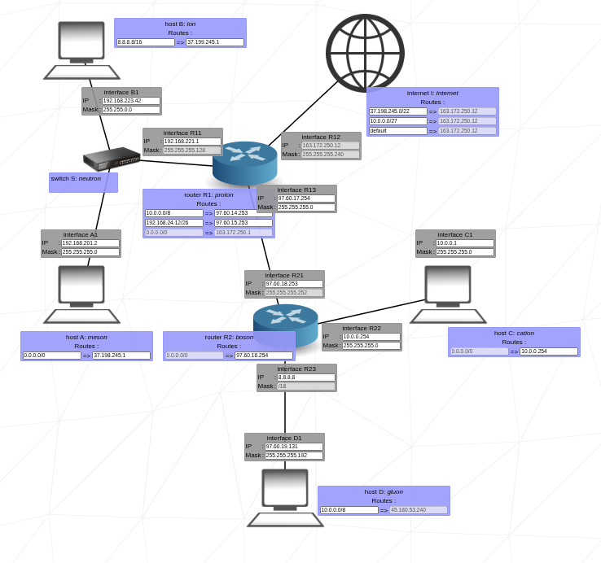

# NetPractice Configurations

This repository contains configuration files for the **NetPractice** project. The project is a practical exercise to help students understand the fundamentals of networking, specifically TCP/IP addressing and basic routing.

## Project Overview

NetPractice is a browser-based simulation that presents 10 networking challenges. For each challenge, the goal is to configure the network so that it functions properly. Once a level is solved, the configuration can be exported as a `.json` file.

## Contents

- `level1.json`
- `level2.json`
- ...
- `level10.json`

Each JSON file represents the configuration solution for a corresponding level in the NetPractice simulator.

This example is from Level 9 of the project.
In the simulation, the network status shows as KO. However, if you open the corresponding .json file and review the IP addresses and subnet masks that I configured while solving this level, you’ll see that the result is actually OK.

